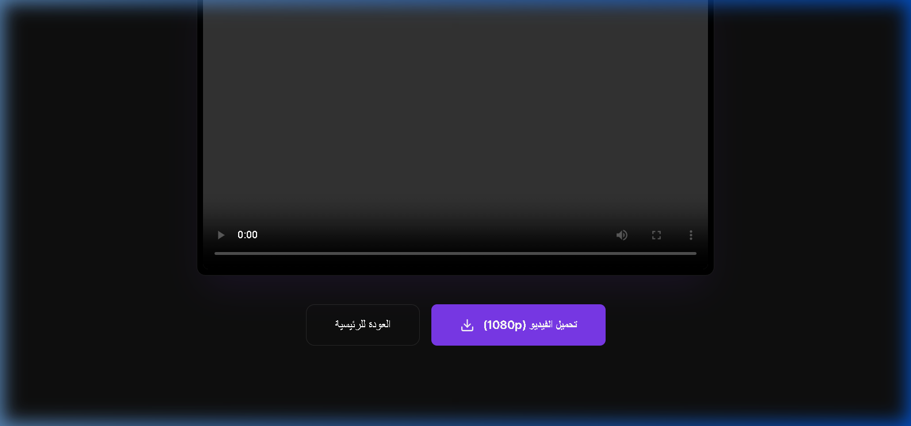

# 🎬 Dynamic Video Content Creator

**Architected and Developed by:** Ahmed Maamoun

---

## 📖 Overview

Dynamic Video Content Creator is an advanced automation platform that transforms raw ideas into professional, production-ready videos in minutes. It bridges the gap between text formulation and video rendering by orchestrating scripts, visual assets, and FFmpeg processing into a unified pipeline.

---

## 📸 Platform Previews

<div align="center">
  
</div>
<br/>
<div align="center">
  
  
</div>
<br/>
<div align="center">
  
</div>

---

## ✨ Core Engineering Features

- **Automated Scripting Engine:** Formulates professional scripts based on user prompts.
- **Visual Asset Generation:** Generates cinematic images and overlays perfectly timed with the script context.
- **FFmpeg Rendering Pipeline:** Assembles scenes, audio, and transitions programmatically into high-quality MP4 outputs.
- **Premium UI/UX:** A highly responsive, Framer Motion-powered dark mode interface built with Next.js.
- **Multi-language Support:** Robust internationalization capabilities for diverse content creation.

---

## 🧠 Technical Challenges I Overcame

Building an automated video rendering engine locally presented unique technical hurdles:

1. **Programmatic Video Assembly (FFmpeg):**
   - *Challenge:* Stitching together dynamic lengths of audio and images into a single video stream without memory leaks or timing mismatches.
   - *Solution:* I engineered a robust Node.js abstraction layer over FFmpeg. By calculating exact durations for each generated audio file, I mapped complex filter graphs (`complexFilter`) to accurately timeline the image overlays, transitions, and audio tracks, ensuring exact synchronization in the final render.
2. **Managing Long-Running Tasks:**
   - *Challenge:* Video generation takes time. Standard HTTP requests would time out or block the Node event loop.
   - *Solution:* I decoupled the generation process using a message queue system. The client initiates the job and receives a Job ID, then polls the server via WebSockets/SSE for real-time progress updates, ensuring the server remains unblocked and the UX remains fluid.

---

## 🛠️ Technology Stack

| Layer | Technology |
| :--- | :--- |
| **Frontend** | Next.js, Tailwind CSS, Framer Motion |
| **Backend Engine** | Node.js, Express, FFmpeg |
| **Asset Processing** | Sharp, Custom Audio Handlers |

---

## 🚀 Quick Start

1. **Clone the repository:**
   ```bash
   git clone https://github.com/Maamoun0/dynamic-video-creator.git
   cd dynamic-video-creator
   ```

2. **Install FFmpeg:**
   *Ensure FFmpeg is installed on your OS and available in your system PATH.*

3. **Install Dependencies & Run:**
   ```bash
   npm install
   npm run dev
   ```

---

## 👨‍💻 Author

**Ahmed Maamoun**
- GitHub: [@Maamoun0](https://github.com/Maamoun0)
- LinkedIn: [Ahmed Maamoun](https://linkedin.com/in/your-linkedin-profile)

Engineered with surgical precision by Ahmed Maamoun.
