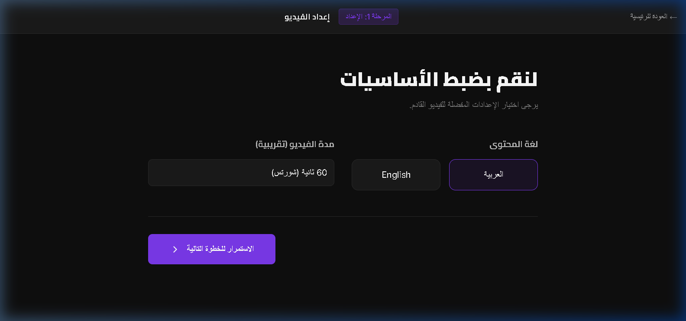

# 🎬 AI Video Content Creator 🚀
> تحويل الأفكار إلى فيديوهات احترافية في دقائق باستخدام أقوى تقنيات الذكاء الاصطناعي.


## 🌟 Overview | نظرة عامة
**AI Video Content Creator** هو تطبيق متكامل (Full-stack) يهدف إلى أتمتة عملية صناعة المحتوى المرئي. يقوم النظام بتحويل فكرة نصية بسيطة إلى فيديو كامل يتضمن:
- سكريبت احترافي مُولد بواسطة **Gemini 2.5 Flash**.
- صور سينمائية فريدة لكل مشهد مولدة عبر **Pollinations AI** (Imagen Path fallback).
- مونتاج آلي وتجميع للمشاهد باستخدام **FFmpeg**.
- واجهة مستخدم عصرية (Glassmorphism UI) تدعم اللغة العربية والإنجليزية.

---

## ✨ Features | المميزات
- **🤖 Artificial Intelligence**: يستخدم أحدث نماذج Google Gemini لصياغة السيناريوهات.
- **🖼️ Automated Assets**: توليد صور ذكية لكل مشهد تتناسب مع المضمون.
- **🎞️ Final Rendering**: تجميع آلي للفيديو بجودة 1080p مع دعم أبعاد الـ Shorts/Reels (9:16) والـ YouTube (16:9).
- **🎨 Premium UI/UX**: واجهة مستخدم داكنة وسلسة تعتمد على React و Tailwind CSS.
- **⚡ Fast Production**: دورة إنتاج كاملة تبدأ من الفكرة وتنتهي بالفيديو الجاهز للتحميل في أقل من دقيقة.

---

## 📸 Screenshots | لقطات من التطبيق

### 1️⃣ Setup Step | مرحلة الإعداد


### 2️⃣ Script Generation | توليد السكريبت


### 3️⃣ Asset Discovery | تجميع الأصول


### 4️⃣ Final Video Output | النتيجة النهائية


---

## 🛠️ Tech Stack | التقنيات المستخدمة
- **Frontend**: React 19, Vite, Tailwind CSS, Zustand, Lucide React.
- **Backend**: Node.js, Express, TypeScript.
- **AI Models**: Google Gemini 2.5 Flash, Pollinations AI.
- **Processing**: FFmpeg (Core Video Engine).

---

## 🚀 How to Run | كيفية التشغيل

### Prerequisites | المتطلبات
- Node.js (v18+)
- FFmpeg installed on your system.

### Installation | التثبيت

1. **Clone the repo**:
   ```bash
   git clone [YOUR_REPO_LINK]
   ```

2. **Backend Setup**:
   ```bash
   cd backend
   npm install
   # Create .env file with your GOOGLE_AI_STUDIO_API_KEY
   npm run dev
   ```

3. **Frontend Setup**:
   ```bash
   cd ../frontend
   npm install
   npm run dev
   ```

---

## 👨‍💻 Developer
Created with ❤️ by **Maamoun**.

---

### 📄 License
This project is for educational and showcase purposes.
