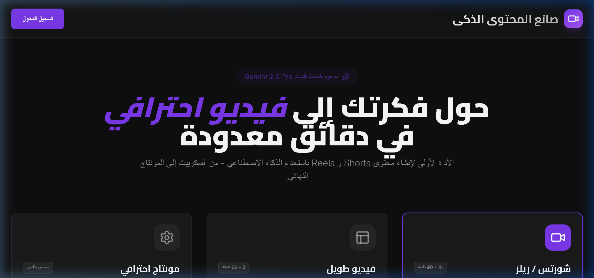
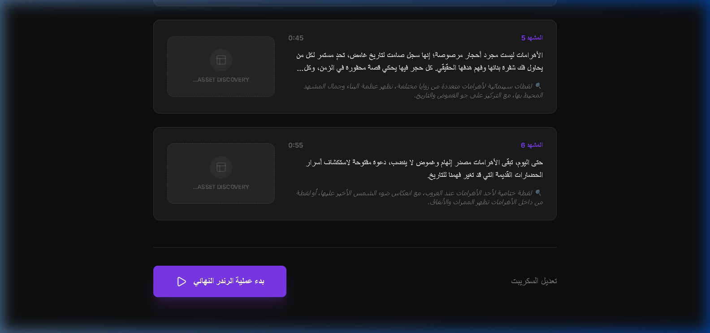

# 🎬 The Video Forge
### Automating Creativity with Code

**By Ahmed Maamoun**

---

## 🎯 The Goal
Can we make professional video content without opening a single video editor? That was the question I set out to answer. **The Video Forge** (Dynamic Video Content Creator) is an experimental pipeline that takes a sentence and turns it into a fully rendered MP4.

---

## 📸 See it in Action

  

 

| Step 1: Scripting | Step 2: Visualizing |
| :--- | :--- |
|  |  |

---

## ⚡ How it works
1.  **Orchestration:** You give it a topic.
2.  **Scripting:** The system generates a structured script.
3.  **Synthesis:** It picks/generates relevant images and overlays.
4.  **The Render:** **FFmpeg** stitches it all together in the background.

---

## 🧠 Behind the Scenes: The Rendering Engine
The hardest part was the **FFmpeg Complex Filter Graph**. 

Stitching images is easy, but making them move (Ken Burns effect) and overlaying text that syncs exactly with the audio duration required deep-diving into low-level media processing. I developed a Node.js script that dynamically calculates the timestamp for every frame, generating a massive 500-line FFmpeg command on the fly. It's a bit of "black magic" that makes the final video look like it was manually edited.

---

## 🛠 My Toolbox
*   **Next.js & Framer Motion** (for the snappy UI)
*   **Node.js & FFmpeg** (the rendering powerhouse)
*   **Sharp** (for lightning-fast image processing)

---

### 👋 Connect
**Ahmed Maamoun**
[LinkedIn](https://linkedin.com/in/your-linkedin-profile) | [GitHub](https://github.com/Maamoun0)

*Coding the future of content.*
